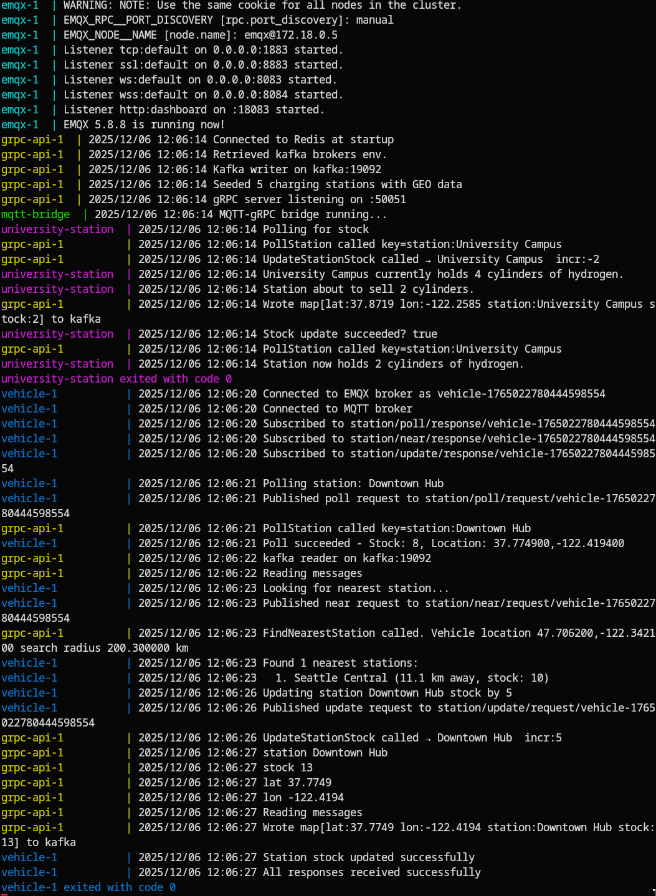

# grpc-redis-kafka

## Prerequisites
- Docker (tested on Docker version 29.1.1)

## Instructions
From project root run:
```
chmod u+x run-example.sh
chmod u+x cleanup.sh
```

Then run to build and start required services:
```
./run-example.sh
```

Take a look at the logs to see the unrolling of the architecture.


Finally:
```
./cleanup.sh
```
This stops the services and removes images, networks, volumes and so on...

In case this doesn't work the logs are the following:
